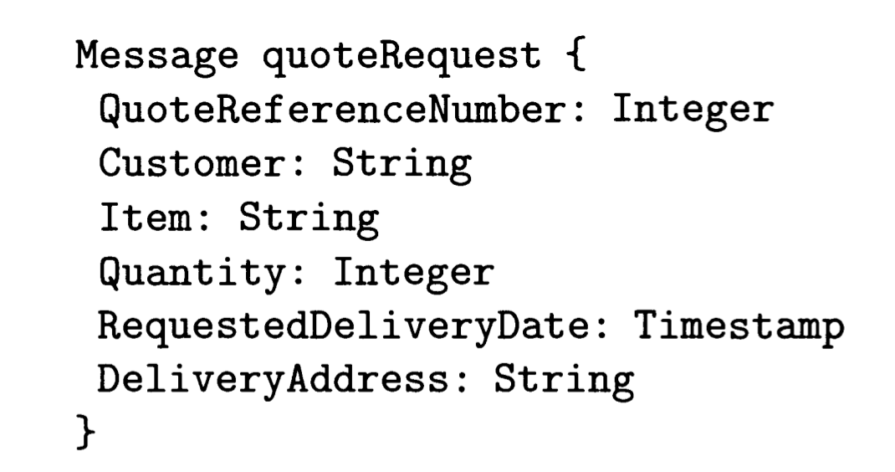
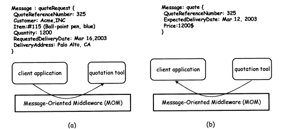
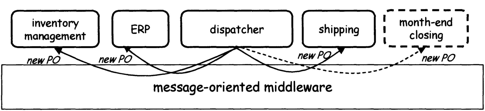
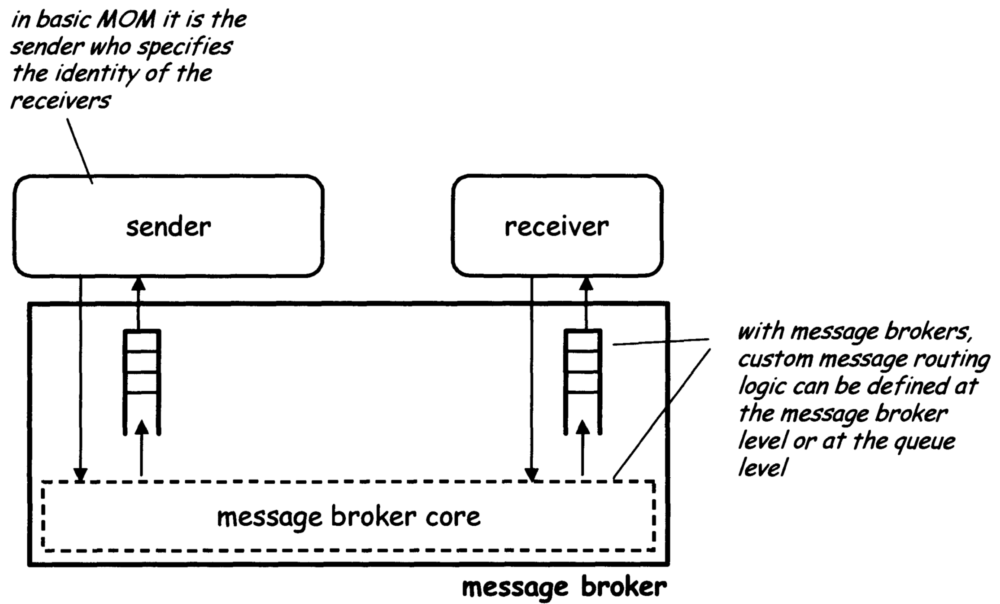
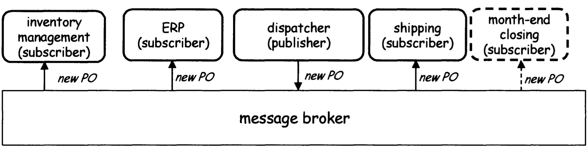
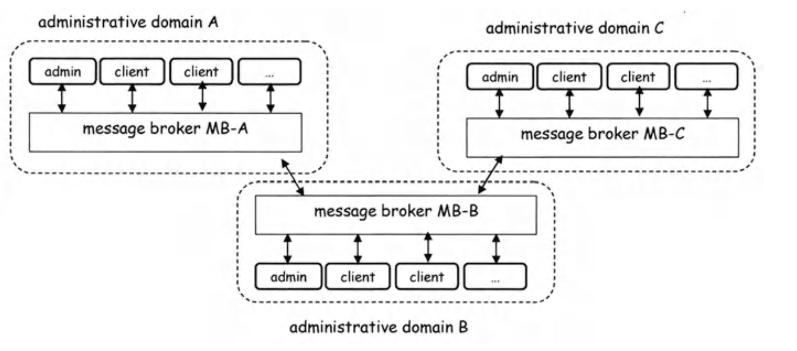
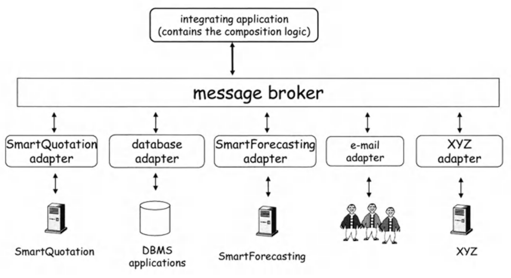
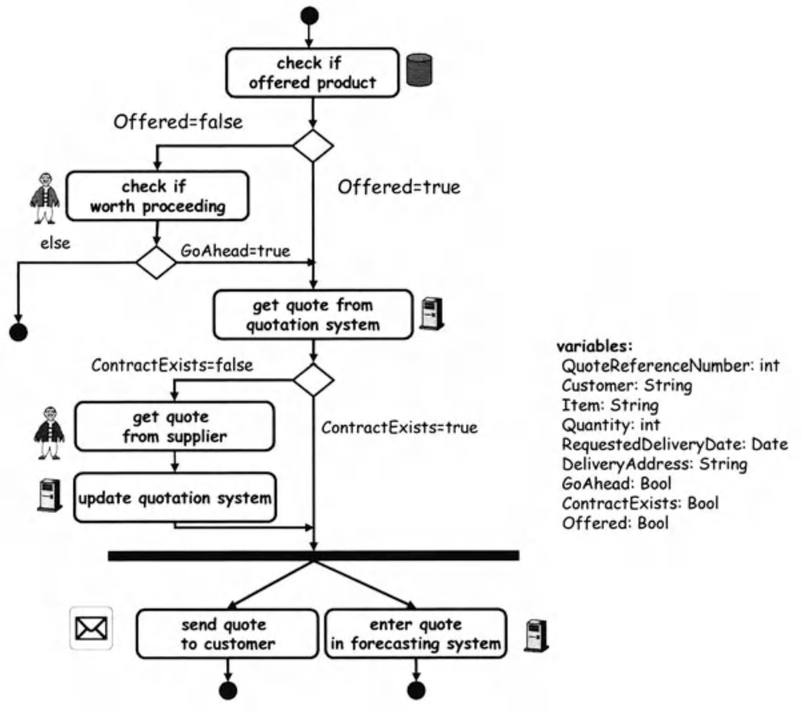
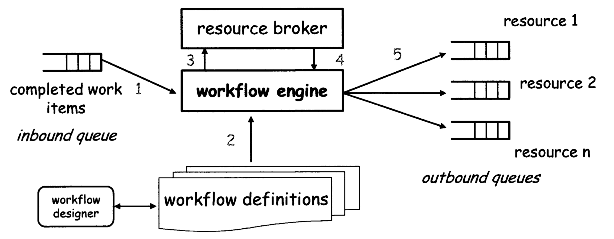
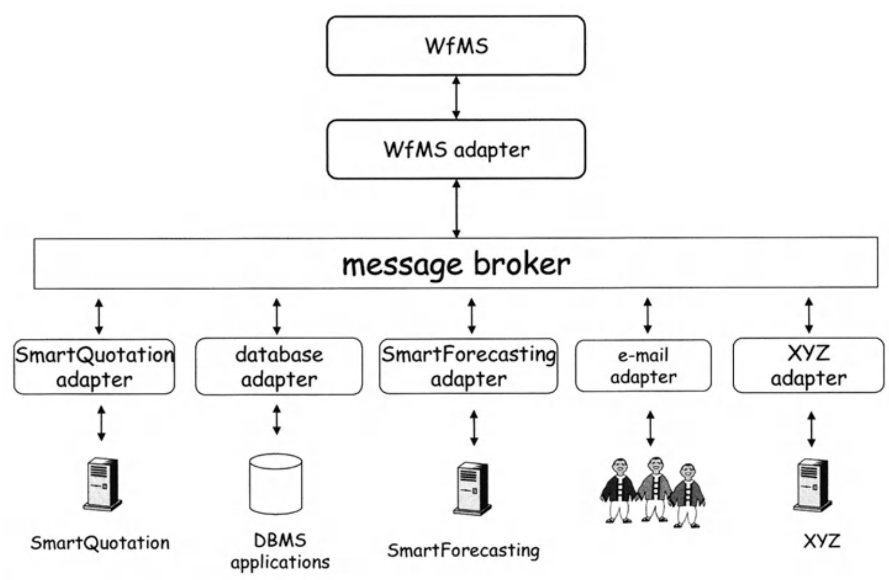

# EAI: Enterprise Application Integration

## Book chapter 2 from 2.5 (p.59)

### 1.	How does message-oriented middleware work and what is message queuing? What are the application areas and limitations of message-based middleware?

Message-oriented middleware is often presented as a revolutionary technology that may change the way distributed information systems are built.
 
The idea is, however, not new. Originally, asynchronous interaction was used to implement batch systems.
 
RPC implementations already offered asynchronous versions of RPC, and many TP monitors had queuing systems used to implement message-based interaction.
 
Modern message-oriented middleware is, for the most part, a direct descendant of the queuing systems found in TP monitors. In TP monitors, queuing systems were used to implement batch processing systems.
But as TP monitors were confronted with the task of integrating a wider range and larger numbers of systems, it quickly became obvious that asynchronous interaction was a more useful way to do this than RPC.
Some often best-known MOM platforms include IBM WebSphere MQ (formerly known as MQ Series) [100], MSMQ by Microsoft [137], or WebMethods Enterprise by WebMethods [213J. CORBA also provides its own messaging service
### Message-Based
The term message-based interoperability refers to an interaction paradigm where clients and service providers communicate by exchanging messages.

### What is the message-Base?
A message is a structured data set, typically characterized by a type and a set of <name,value> pairs that constitute the message parameters.
The type used to be system dependent; nowadays, most products use XML types.
 
As an example, consider a message that requests a quotation from a vendor about the price of a set of products.
The message parameters include the name of the requesting company, the item for which a quote is being requested, the quantity needed, and the date on which the items should be delivered at a specified address.
In general, the language for defining message types varies with the messaging platform adopted.

### how message-based interoperability works?
This interaction is depicted. 
We refer to the quotation system as being the service provider, while the application receiving the customer's request is the client in this case.
 

Fig. 2.11 an application sends a mes- sage to a quotation tool (a). 
The tool serves the request by sending another message (b) 

With message-based interoperability, once clients and service providers agree on a set of message types, they can communicate by exchanging mes- sages. 
To request a service, the client application sends a message (for exam- ple, a quoteRequest message) to the desired provider. 
The service provider will receive the message, perform appropriate actions depending on the message content (for example, determine a quote), and send another message with the required information back to the client.

### What support the class of middleware application?
The class of middleware applications that support message-based interoperability is called message-oriented middleware (MOM).
**Note that although we use the terms client and service provider**, this distinction is blurred in pure message-oriented interactions, at least from the perspective of the middleware.
Indeed, to the MOM, all objects look alike; i.e., they send and receive messages.

### What is different between “Client” and “service providers”?
The difference between "clients" and "service providers" is purely conceptual and can only be determined by humans who are aware of the semantics of the messages and of the message exchange.
 
This is different with respect to the other forms of interaction discussed earlier, where objects acting as clients invoke methods provided by other objects, acting as servers.
----------------------------
## 2- Explain differences and commonalities of middleware and EAI. (3, 3.1)

Middleware and enterprise application integration (EAI) are not completely orthogonal concepts. 
They are, however, distinct enough to warrant separate treatment. 
As we saw in Chapter 2, middleware constitutes the basic infrastructure behind any distributed information system. Initially, middleware was used to construct new systems and to link to mainframe-based systems (2- tier architectures).
  Later, it was used to distribute the application logic and to integrate the many servers created by 3-tier architectures. 
**When the systems involved were compatible and comparable** in their functionality and did not involve many platforms,
**middleware could be used without further ado to integrate the servers.** Unfortunately, for more **ambitious projects**, plain **middleware was not enough.** 
The main limitation was that any **concrete middleware** platform makes implicit assumptions about the nature of the underlying systems. 
**When these systems are very different in nature and functionality, using conventional middleware to integrate them becomes rather cumbersome, and in some cases simply infeasible.**
 

### EAI Enterprise Application Integration
EAI can be seen as a step forward in the evolution of middleware, extending its capabilities to cope with application integration, as opposed to the development of new application logic.
 
Such extensions involve some significant changes in the way the middleware is used, from the programming model to the marked shift toward asynchronous interaction.
### what happened When 3-tier architectures and middleware emerged?
When 3-tier architectures and middleware emerged, they addressed two issues.
* by separating the application logic layer from the resource management layer, the resulting architecture became more flexible.
  This approach gained even more relevance when systems began to be built on top of computer clusters instead of powerful servers, a trend that was markedly accentuated by the Web.
* they served as a mechanism for integrating different servers.
   In this regard, middleware can be seen as the infrastructure supporting the middle tier in 3-tier systems.
  
As such, it is the natural location for the integration logic that brings different servers together. For instance, the accepted way to integrate different databases was to use a TP monitor.

### From a Set of Servers to a Multitude of Services (3.1.2)
The use of middleware led to a further proliferation of services. In fact, 3-tier architectures facilitate the integration of different resource managers and, in general, the integration of services.
  The functionality resulting from this integration can be then exposed as yet another service, which can in turn be integrated to form higher-level services.
This process can go on ad infinitum, leading to a proliferation of services.

+ **The big Advantage** id that each new layer of services provides a higher level of abstraction that can be used to hide complex application and integration logic.
+ **The disadvantage is** is that now integration is not only integration of resource managers or servers, but also the integration of services. Unfortunately,
    while for servers there has been a significant effort to standardize the interfaces of particular types of servers (e.g., databases), the same cannot be said of generic services.  
+ **the problem became** the integration of services provided by different middleware platforms, there was almost no infrastructure
    available that could help to reduce the heterogeneity and standardize the interfaces as well as the interactions between the systems.
### in simple word
**Middleware** was originally intended as a way to integrate servers that reside in the resource management layer.
 
**EAI** is a generalization of this idea that also includes as building blocks the application logic layers of different middleware systems.

----------------------------

## 3.Explain the basic principles of message brokers. Include the Publish/subscribe communication principle. (3.2 EAI Middleware: Message Brokers)

### Explain the basic principles of message brokers?
Message brokers are direct descendants of the platforms for message oriented middleware. They are derived from the new requirements posed by EAI,
in terms of supporting the integration of heterogeneous, coarse-grained enterprise applications such as enterprise resource planning (ERP) and CRM systems. 
Indeed, as soon as the problems behind EAI (exemplified in the previous section) were recognized, the limitations of using MOM systems to support EAI become manifest.  

**Message brokers** address this limitation by acting as a broker among system entities, thereby creating a (logical or physical) "hub and spoke" communication infrastructure for integrating applications. 
 
**Message brokers provide** **flexibility in routing**, as well as other **features that support the integration of enterprise applications**.
 
This functionality, together with asynchronous messaging, is exactly what is **needed in generic EAI settings**, and **message brokers are thus emerging as the dominant EAI tool used today.**
 
### why will we need the Message Brokers?
because of a change in the business or IT environment, company policies require additional applications to be notified of the Purchase Order (**PO**).  
An example of such an application could be a month-end closing system that performs book-keeping operations and provides monthly summaries of revenues and profits.  
In this case, the dispatching application needs to be modified to cope with the change and include the code for notifying this additional system.

**Fig. 3.2. With RPC or message-based interoperability, applications need to be changed if they need to interoperate with a new system (dashed)**

### explain the Extending Basic MOM
Message brokers are enhanced **MOM systems** that attempt to overcome this limitation by factoring the message routing logic out of the senders and placing it into the middleware.

Fig. 3.3. Message brokers enable users to define custom message routing logic

senders are not required to specify the intended recipients of a message. Instead, it is up to the message broker to identify the recipients by executing user-defined rules.  
**The advantage of this approach is** that regardless of how many applications can dispatch new PO or stock price change messages, there is now a single place where we need to make changes when the routing logic for these messages needs to be modified.

### Explain the Publish/Subscribe Interaction Model (3.2.4)
the most well-known and widely adopted one is the publish/subscribe paradigm. In this paradigm, as in message-based interaction, applications communicate by exchanging messages, again characterized by a type and a set of parameters.
### what are Publishers?
applications that send messages do not specify the recipients of the message. Instead, they **simply publish** the message to the **middleware** system that handles the interaction. For this reason, applications that send messages are called **publishers**.  
If an application is interested in receiving messages of a given type, then it must subscribe with the **publish/subscribe** middleware, thus registering its interest.
### How are the publishers working?
If an application is interested in **receiving messages** of a given type, then it must subscribe with the **publish/subscribe** middleware, thus registering its interest.
Whenever a publisher sends a message of a given type, the middleware retrieves the list of all applications that subscribed to messages of that type, and delivers a copy of the message to each of them.

Fig. 3.4. Publish/subscribe models make interoperability more flexible and robust to changes 

publish/subscribe interaction in the PO processing example described above. As the figure shows, the PO processing application simply needs to send a message to the message broker, publishing a notification that a new PO has been received.  
All applications interested in new PO notifications will then receive the message, provided that they subscribed to the new PO message type prior to the time the message was sent.

#### In a publish/subscribe model, subscribers have two main ways to define the messages define them? 
to define the messages they are interested in receiving.
+ The first is to specify a message type, such as new purchase order **Po**. In simple cases, the type namespace is flat and is defined by a string.
  For example, if we assume that the type hierarchy is encoded by means of dot-separated strings of the form type.subtype.subsubtype..., then a legal message type name could be Supply Chain.
  new PO.With structured types, subscribers not only can register their interest in messages having a specific type and subtype, but can also subscribe to messages whose type T has another type A as ancestor in the type hierarchy. 
  For example, a subscription to Supply Chain. new PO specifies interest in receiving all messages related to new purchase orders, while Supply Chain.
  * is a more general subscription that declares interest in all supply chain-related messages, including but not limited to new purchase orders.

+ The second form of subscription is parameter-based: subscribers specify the messages they want to receive by means of a boolean condition on the message parameters.
   For example, the condition **type="new PO"** AND **customer= "A CME Co."** _**AND quantity> 1200**_ specifies a subscription to all new PO messages related to orders by ACME Co. whose volume is above **1200** units.

----------------------------

## 4. How is EAI performed using Message Broker and Adapter? What are the advantages, disadvantages and limitations of such an approach?

### what is the basic principles on which most EAI platforms are based?
the basic principles are tow fundamental components:
+ **Adapters** Adapters map heterogeneous data formats, interfaces, and protocols into a common model and format. 
     **what is the purpose of adapters?** 
 
The purpose odf adapters is **to hide heterogeneity** and **present a uniform view** of the **underlying heterogeneous world**.
+ A different adapter is needed for each type of application that needs to be integrated.

**Fig. 3.5.** Clients can interoperate through multiple message brokers distributed across different administrative domains

+ Message broker. A message broker (or a MOM) facilitates the interaction among adapters and therefore ultimately, among the back-end systems that need to be integrated.
   if an **EAI** platform is in place and the adapters for all the system to be integrated have been deployed 

**Fig. 3.6.** High-level architecture of typical EAI systems

### How do amount to EAI-based application integration?
1. Developing an application (often in Java or C) that implements the integration logic. this application interacts with
the message broker (and consequently with the back-end systems accessible through the **message broker** and **the adapters**)
by **publishing** and **receiving messages**. 
2.  **Configuring the adapters** so that they subscribe **to the appropriate messages** and **perform the appropriate action** on the back-end system.

### what is The SmartQuotation Adapter?
**The Smart Quotation Adapter** is an EAI client that enables access to SmartQuotation system via messages.

### Explain EAI performed using the Adapter?
Adapters are typically configured through graphical user interface (**GUIs**) that allow user to define the message that
the adapter can publish or to which it should subscribe.
### how to map messages to method invocation on the back-end system
If adapters for the back-end system are not provided "out of the box" by the EAI vendor, then they must be developed EAI platform
typically include tools that help users in this effort, such as "skeletons" of adapters that can be reused and configured
for bridging the message broker with a back-end System 

Once all the adapters have been configured, the process logic can be im- plemented by writing an RFQ processing application that:
- Subscribes to messages of type quote.
- Publishes quoteRequest messages as a quote is requested.
- Extracts relevant parameters as a quote message is received, and creates and publishes a newQuote message.

### what are the benefits via messages broker entails?

+ **Lower development cost.** 
  Integration is simpler and can be done more quickly. The integration is simpler because systems are loosely coupled and 
  the biggest part of the integration effort can be localized in the adapters. This is in contrast with the tightly integrated
  systems resulting from using TP monitors or object brokers.
   
   
+ **Lower Opportunity costs.**  
  Since integration is done more quickly, the automation (and the corresponding cost savings) can be achieved sooner.
  This directly affects the ability to implement new services and expand the capabilities of the overall infrastructure of the enterprise.
  It is also possible to react more rapidly to demands for new services, and more services can thus be offered than if alternative 
   solutions (i.e., RPC-based middleware platforms) were used.
   
   
+ **Lower maintenance effort.** 
  The use of adapters has the effect of extracting the interaction with external systems as an orthogonal concern and localizing the related logic in a single module: the adapter.
  This offers significant advantages from the software engineering point of view. For in- stance, if new versions of existing systems are introduced, the EAI vendor will very likely provide new adapters for them.
  The application that exe- cutes the integration logic will thus not have to be changed substantially since the interaction between the integration logic and the underlying applications happens through the adapters.  

### Despite these advantages
message brokers are not a panacea for all application integration problems. Indeed, there are many drawbacks to implementing EAI solutions using message brokers.

### The main issue is that software licenses are extremely expensive.
An EAI message bus, along with its development and management tools, may cost several hundreds of thousands of dollars, or even millions of dollars.
In addition, each adapter costs additional significant amounts of money.
Besides, licensing costs, companies need to invest in the training of IT personnel and acquire the resources necessary for 
the installation and operation of the tool. Finally, while the development of applications that compose existing systems is certainly made easier if an EAI tool is available,
it is still a significant effort. In fact, developers must still code the application integration logic, configure the adapters,
and even de- velop adapters for those systems not supported by the message broker-based EAI platform.

--------------------------------------------------------

## 5. How do Workflow Management Systems (WfMS) work during development and during runtime? (3.3) p.82

**Workflow management systems (WfMSs)** tackle the other side of the application **integration problem**:  
that of facilitating the definition and maintenance of the integration logic.

### WfMSs have their origins in the domain of office automation:-
The first WfMS implementations were aimed at automating administrative processes based on paper documents, such as travel expense reimbursement or review of project proposals. 
**The goal was to use an electronic version of the document** rather than a paper copy, and use the WfMS to take care of routing the document from one point to another
Many initial implementations were e-mail-based and later substituted by Web-based forms. Workflows that implement such office procedures are called administrative workflows
and are widely used today in document processing and document management suites.

### Workflow Definition
Before discussing a WfMS in detail, we introduce some terminology that is used in this and later chapters.  

#### what is business process?
business process as a collection of activities performed by human users or software applications that together constitute  
the different steps to be completed to achieve a particular business objective.  
**Examples of business processes** include the procedures for travel expense reimbursements within a company, the procedure for hiring new employees, or the procedures to process purchase orders from clients.

### What is Workflows management system?
A workflow management system is a software platform that supports the design, development, execution, and analysis of workflow processes. 
Typically, a workflow is specified by a directed graph (called a flow graph) that defines the order of execution among the nodes in the process. 
**Nodes can be of one of the following types:**

+ **Work node.** Work nodes represent work items to be performed by a human or automated resource.
+ **Routing node.** Routing nodes define the order in which work items should be executed, and allow the definition of parallel or conditional activation of work nodes.
+ **Start and completion nodes.**  Start and completion nodes denote the starting and ending points of the workflow.

**Fig. 3.8.** A sample workflow specification that models a quotation process  

The semantics of the flow in Figure 3.8 are as follows: as a new workflow instance is started, work node check if offered
product verifies whether the products mentioned in the request for quote are already offered by the vendor.

### what are workflow instances?
Workflow instances are executed by a **workflow engine.**  
**what is the Engine?** The engine is basically a scheduler: it schedules the work to be done and assigns it to an appropriate executor (called a resource in workflow terminology).
Concisely, a workflow engine works as follows (Figure 3.9): Whenever a new workflow is instantiated, the engine retrieves
**the workflow definition** from the **repository** and **determines** the node(s) to be executed, i.e., the ones that are connected in output to the start node. 
**The "work" can take many forms:** it can be a query to be executed on a database, a short message service (SMS) to be sent to a cellphone, or a form to be filled by a user. 
However, they all look alike from the WfMS perspective, and specifically they have the form of messages sent to a resource. How the resource carries out the work is irrelevant to the WfMS.

**Fig. 3.9.** **Scheduling and assignments** are the basic tasks of a WfMS, and specifically of the WfMS engine, which is at the heart of a WfMS   
Note that resources do not necessarily have to pull work from the work queue in a **first-in-first-out fashion:** 
in general, they have the freedom of selecting the work item they want to execute next. 
We also observe that although the **"pull"** model described above is the one adopted by most systems (especially when resources are humans),
workflow engines can also push work to the resources, typically by invoking a specified method of the resource API.

-----------------------------------------------

## 6. How can WfMS be used for EAI (Programming in the large, integration with other middleware technologies)? What are the advantages and limitations of WfMS?

As the previous sections have shown, a workflow is similar to a program writ- ten in a third-generation language (3GL).
In fact, it is basically characterized by   the invocation of several functions in an order specified by some flow logic. 
The effect of loops and conditional statements is modeled here by inserting appropriate routing nodes.  
In addition, as in programming languages, a workflow can have variables (data items) that can be passed as input to or taken as output from work node invocations.
These variables are used to evaluate routing conditions and to pass data among nodes.  
**Despite these similarities, workflows** also present **significant differences with respect to programming languages**.
1. The first is that of scale. Typically, procedures invoked in the context of a computer program are short-lived. 
    Instead, workflows typically compose coarse-grained activities and applications that can last hours or days.
2. very important difference is the granularity at which composition takes place in workflow management systems when compared to programming languages.

**As the language for EAI,** workflows need to **incorporate functionality** that goes well beyond what can be **typically found in programming languages.**
As the language for EAI, workflows need to incorporate functionality that goes well beyond what can be typically found in programming languages.
For instance, a consequence of workflows being long-lasting is the need for **sophisticated failure-handling techniques.**
+ If a computer program fails for any reason, the typical solution is to restart it.
+ If a transactional application fails, then the solution consists in rolling back the partial execution and again restarting it.

**However, neither of these solutions is satisfactory in workflow management.
Indeed, since executing a workflow can be very expensive in terms of time and money,
restarting from scratch (with or without rolling-back the partial execution) is often not a desirable option.**
  In addition, providing atomicity in a workflow is not as easy as in database applications or message queuing,
since the unit to be rolled back is not a database update or a message retrieval, but can be any kind of action, such as sending a letter to a customer.
Rolling back this kind of operation may cause work to be lost and is also difficult because the appropriate rollback action depends on the actions that need to be undone.  
Furthermore, because workflow applications are typically long-lived, it is not acceptable to hold (lock) the database resources necessary
to be able to perform a rollback in case the need arises, as this would cause an excessive delay for other applications that need to access the same data.

### To support failures, WflSs provide a set of modeling abstractions and the relative system support:

* **Forward recovery**. WflSs maintain the workflow instance execution state in a persistent storage.
   If the system fails, when it recovers from the failure it will be able to continue the execution of the workflow instances that were active at the time of the failure.
   The only work lost is the one performed by nodes that were active at the time of failure and had not yet communicated their results back to the WflS.
* **Backward recovery**
  WflSs also provide backward recovery to support those cases in which it is not possible to complete a workflow and the partial
  execution needs to be undone. Backward recovery is supported through transactional abstractions that closely resemble those of sagas [78]:
  the idea is to associate with each work node a compensating activity whose execution semantically undoes the effects of the work node.
  For exam- ple, the compensation for sending a quote to a customer would involve sending another message to the customer stating that the quote is no longer valid.
  Backward recovery then involves executing compensating activities for each completed fork node, in the reverse order of forward execution.
* **Exception-handling languages**
  Some Wfl\;[Ss, especially prototypes developed in academia, offer additional primitives for handling exceptions.
* These include mechanisms for capturing events that can occur asynchronously with respect to the control flow (Le., can happen at any time during a workflow execution).
 An example of such an event is a customer canceling a request for quote. Mechanisms to detect "exceptional" occurrences range from additional workflow node types, 
 such as event nodes, [88] to event-condition-action (ECA) rules [45, 59] and Java-style try-catch- throw constructs, or variations thereof.

* **Deadlines**. Being tools for composing and integrating applications, WflSs must deal with the problem of applications that,
after being invoked, fail to respond. This problem is known as deadline expiration.
The usual way to deal with this problem is to associate a time-out with each step of the process.
Once the step is invoked, time starts running. If, when the time-out is reached, the application has not finished or has not responded in any way, the WflS can then take corrective action.
For instance, the job can be rescheduled, execution stopped, or a message sent to a system administrator indicating the problem.

**Another important difference between conventional programming and workflows lies in the resource** that executes the procedure.
In a programming language, the resource is always the computer, and specifically the microprocessor.
In a workflow the resource can be human and can vary depending on the work to be executed and on the nature of the workflow instance.

### Integration of WfMSs with Other Middleware Technologies

workflow technology has many characteristics that resemble those of TP monitors.  
For example, they execute distributed transactions on top of autonomous systems, they manage resource naming and binding, 
and they include performance management and load-balancing functionalities, thereby enabling the concurrent execution of thousands of complex transactions.
In addition, WfMS architectures, just like TP monitors, include a single operating system process (the workflow engine)
that manages all workflow instances, thereby avoiding overloads of the exe- cution platform with a large number of operating system processes. 

**Fig. 3.10.** Workflow and EAI technologies can be combined to automate business processes across the enterprise.
The workflow is used to implement the integration logic (upper box) and the actual interaction between the components takes place though the message broker

**shown in Figure 3.10.** In this approach, all workflow steps are assigned to the same "resource", the WfMSjEAI adapter,
which takes work items from the WfMS work queue and publishs a message to the bus.
The "real" assignment is then done by the message broker, based on the subscriptions by back-end system adapters.
The adapters also collect work results and publish them back to the message broker, who delivers them to the WfMSjEAI adapter and,
ultimately, to the WfMS inbound queue. Therefore, the development of a workflow application that uses an EAI platform involves designing
the flow through the WfMS graphical development environment and configuring the adapters so that they subscribe to the appropriate messages,
invoke the required API on the back-end system, and publish a message with the execution results back to the message broker when the back-end system has completed its job.

### Benefits and Limitations of WfMS

they enable rapid 
+ process de- sign and maintenance,
+ failure and exception handling,
+ as well as catering for performance
+ high availability.
+ Workflow design is also typically supported by a graphical development environment that,
+ combination with the model, aims at enabling the definition of complex business processes through point- and-click interfaces.

### Some of their problems and limitations were common to those of EAI platforms:
+ expensive software licenses,
+ complex installation and operation,
+ and long development cycles to actually automate real business processes. 

In the case of WfMSs, these problems were compounded by the fact a WfMS had to implement a complete middleware platform
to provide the necessary run-time environment. As a result, WfMSs turned out to be heavyweight platforms, difficult to operate and maintain.
In addition, WfMSs proved to be most useful with repetitive, well-defined processes (i.e., that could be subjected to formalization using a workflow language).
