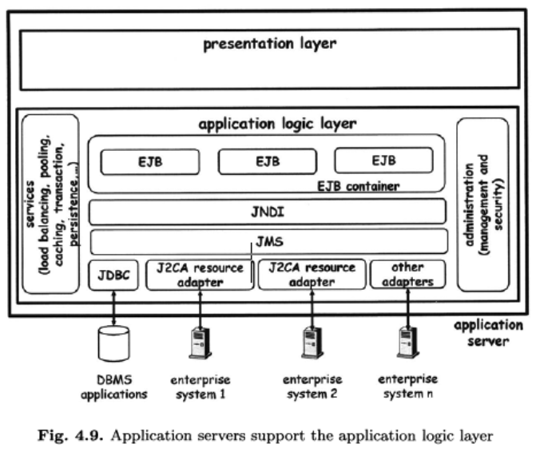

#WAL Web Application Integration and Web Services Concepts 
#### Book Chapter 4, Chapter 5 till 5.1 (P.136)


## 1. Explain the impact of major web technologies (HTML, HTTP, CGI, servlet, applet) on system integration, and especially focus on B2C focus on B2C and remote clients.

### HTML 
the HyperText Markup Language (HTML), which defines a standard set of special textual indicators (markups) that specify 
how a Web page's words and images should be displayed by the Web browser.

### HTML and HTTP:
Since Web browsers are standard tools, no application-specific clients need to be installed. Companies can take advantage
of the existence of such a standard client by using widely available tools for building a browser-based access channel for
their application. In practice this has given rise to new Web technologies for wrapping local information systems to support the new access channel.


### CGI:

If we view Web servers as interfaces to distributed information systems, they must be able to serve up content from dynamic sources
(e.g., publish information retrieved from a database).
The issue then is, **for example**, how a Web server can respond to a request (triggered by addressing a URL) by invoking 
an application that will automatically generate a document to be returned.
<br>

One of the first approaches to **solve this problem** was to use the Common Gateway Interface **(CGI)**, a standard mechanism that enables
HTTP servers to interface with external applications, which can serve as "gateways" to the local information system.
CGI assigns programs to URLs, so that when the URL is invoked the program is executed. Arguments or additional information needed
by the program (such as parameters or path information) are sent as part of the invoked URL.

when a request for a URL goes to that directory, the Web server knows it must start a program rather than return an HTML page.
From the URL received, the Web server extracts any information it may need to pass on to the program (i.e., parameters for a query or arguments for the program)
and starts the program as a separate process . These programs can then be used to interact with the underlying middleware (see Figure 4.5).


For example, CGI programs often serve as an interface between a database and a Web server,
allowing users to submit complex queries over the database through predefined URLs. The parameters of the query are embedded into the URL.
When the Web server receives the request for the URL, it will run a program that will act as a client of the database and submit the query.
The program executes the query, then packs the query results into a HTML document to be returned to the remote browser.


### Servlets

From a performance point of view, CGI programs involve a certain overhead.
First, a separate process is usually created for each instance.
The creation of the process takes time and requires a context switch in the operating system to pass control to the CGI program.
The result is an increase in the overall response time of the system.
**In addition**, multiple requests result in multiple processes being created, all of them competing for resources such 
as database connections or memory (multiple requests to the same CGI program result in the program being loaded in memory once for every request),
thereby limiting the scalability of the system.

To avoid this overhead, Java servlets can be used instead of CGI programs. 
The idea is exactly the same as in CGI programs but the implementation differs (Figure 4.6). 
The execution of a servlet is triggered in the same way as a CGI script: by addressing a URL.
**The result** is also the same: a document is returned. Unlike CGI, however, **servlets are invoked directly by embedding servlet- specific information within an HTTP request**.

Servlets run as threads of the Java server process rather than as independent processes.
Moreover, they run as part of the Web server.
This eliminates the overhead of having to create a process for each invocation and the cost of context switching.
It also reduces memory requirements, as a single program image is used even if multiple requests to the same servlet occur simultaneously.

Since there is a persistent context for the execution of the servlets (the Java server process), it is possible to use
optimizations that would be rather cumbersome to implement when using CGI programs.
For instance, results of previous requests can be cached so that identical requests from different clients can be answered without actually having to execute the operation.
Session tracking, sharing of database connections, and other typical optimizations that help with scalability are also easier to implement with servlets than with CGI programs.


### Applets:
Applets are Java programs that can be embedded in an HTML document.
When the document is downloaded, the program is executed by the Java virtual machine (JVM) present in the browser.
Hence, the way to turn the browser into a client is to send the client code as an applet.
This, of course, suffers from the limitation of having to download the code every time the client is used.
Nevertheless, for applications based on thin clients, it is a very common solution.
<br>
Applets have the significant advantage of turning a Web browser into an application-specific client without complex configuration or installation procedures.
However, because applets exist only for the lifetime of a particular browser instance, they are transient,
and are thus inadequate for supporting complex client code or frequent interactions.
An alternative is to use a specialized client that is not based on a browser but contains the necessary code to interact with a Web server through HTTP.
Such an approach does not have any of the limitations of applets but requires a specialized client.
In this case, the advantages and disadvantages are identical to those of client/server systems.


--------------------------------------------------------------

## 2. Explain architecture and usage of application servers using J2EE. Pay particular attention to the support of the application layer?

The increasing use of the Web as a channel to access information systems forced middleware platforms to provide support for Web access.
This support is typically provided in the form of application servers.
Application servers are equivalent to the middleware platforms discussed in earlier chapters.
The main difference is the incorporation of the Web as a key access channel to the services implemented using the middleware.


Presentation layer acquires a much more relevant role than in conventional middleware.
This is a direct consequence of how HTTP and the Web work, where all forms of information exchange take place through documents.

Preparing, dynamically generating, and managing these documents are thus a big part of 
**what an application server needs in order to extend a middleware platform to one with Web access capabilities**.
This is typically done by merging the presentation layer related to the Web with the application layer of the middleware platform (Figure 4.7).


Figure 4.8 summarizes the main components of the J2EE specification.


### It is a 3-tier architecture, but all parts (PL, AL and RL) come from one source. The example J2EE looks like this:

- PL: Servlets, JSP, Java API for XML, JavaMail, Java Authentication Service 
- AL: Enterprise Java Beans, Java transaction API, JMS, JNDI
- AL for RL: JDBC (Java Database Connectivity), adapter for other systems.

At the application layer, application servers conceptually resemble conventional middleware.
The functionality provided is similar to that of CORBA, TP monitors, and message brokers.
This is why application servers are not limited to Web-based integration, but can also be used for EAr.
The goal of application server vendors is in fact to provide a unique environment for hosting all kinds of application logic, whether Web-based or otherwise.
As part of this effort, application servers try to provide typical middleware functionality
(e.g., transactions, security, persistence) in an automatic manner when the application is deployed in a given server.
In this way, application developers do not need to handle this functionality themselves, as these 
properties are acquired on the fly by deploying a program within an application server.

### In J2EE, the support for application logic concentrates on three main specifications:
- EJB <br>
Enterprise Java Bean(s), most of the program logic is located in these modules. 
(Serverside component that provides application-specific functionality, e.g. responding to a request for a quote or executing a purchase order) 
3 types of bans (session beans: trade a session with the client (stateful or stateless), entity 
beans: are beyond the boundaries of a session with the client (have a status stored in a database or other persistent memory),
message driven beans: are responsible for asynchronous interactions with the clients)


- JNDI
  **Java Naming and Directory Interface**: Interface that makes it possible to find modules for other application parts
in existing names and directory services under a specific object name, so that they can be connected to the modules can bind.


- JMS
  is an API that provides the facility to create, send and read messages.
  It provides loosely coupled, reliable and asynchronous communication.
  JMS is also known as a messaging service. Messaging is a technique to communicate applications or software components.
  JMS is mainly used to send and receive message from one application to another.



---------------------------------------------------------

## 3. Explain the Application Server Support for the Presentation layer?
Support for presentation layer and for the document as the basic unit of transfer is what differentiates app servers from conventional middleware.
CGI programs take a blackbox approach (kind of) in implementing the presentation layer of a web app. They try to link to the Middleware platform w/o requiring changes to it.
- Advantage:
   Can be used on top of systems, that were not prepared to handle wide area integration.
   (legacy systems could become web-enabled by wrapping the client with a CGI program) 
    Anyway MW should not be treated as a blackbox, but with modifications to provide the necessary support it makes services accessible through the web.

### A modern app server supports the following types of clients:

- Web browsers, including both those requesting plain HTML pages and those downloading
   and executing applets.
- Applications, such as those encountered in conventional middleware.
- Devices, such as mobile phones or PDAs.
- E-mail programs.
- Web services clients, i.e., applications that interact with the server through standard Web
  services protocols.

Web browsers are the most common. They interact with the app server through HTTP or HTTPS and receive generated HTML pages.
Dynamic pages can include servlets, JSP and ActiveX. (care: old book!) In J2EE and .NET dynamic components are integrated with the app logic layer.

If the client is an applet instead of a web browser, the communication w/ the app server may occur through other protocols (than Http). 
Applets may interact with an app server through RMI or CORBA //IIOP.


Application servers aim to transparently support different protocols by wrapping the document into whatever protocol is needed by the client.
In this way, developers do not have to write different code for different clients.


Another type of client is the web services client. It requires SOAP as well as other languages and infrastructures.
App server support for interaction with web services clients include facilities for creating, parsing and validating XML documents,
as well as for packaging and unpacking messages to be delivered through SOAP.

Besides, supporting different types of clients; it supports different types of users.
Conditions can be set up (e.g.: specific content for AT users or “Premium” users and so on).

As the figure shows, the app server also provides number of services that help manage performance, availability, security and administration.


## 4. Explain the importance of a uniform data exchange format in wide area integration. What are the commonalities and differences regarding the approach of EDI/ EDIFACT and XML.

Possibility of FTP, HTTP & SMTP for automatic exchange of messages between companiesànew challengeàidentifying a common syntax and semantics for the data exchanged between applications.

### Assumption:
two parties are each able to interpret the information contained in the exchanged data.
Conventional Middleware platforms, the problem of data representation is hidden behind IDLs.

### IDL: 2 roles:
- define interfaces
- implementation of the IDL uses an intermediate data representation that specifies how each data type used in IDL is
  represented in a machine-independent manner. -> helps bridge differences between OS and computer architecture.

In message-based systems, the format and semantics of the messages or files exchanged are typically determined by 
the EDIFACT standard (Electronic Data Interchange For Administration, Commerce and transport). 
EDIFACT provides standard templates for messages and for the contents of the messages.
For messages, it defines the different parts of a message and how to organize its contents so that it can be properly parsed by the recipient.

### An EDIFACT msg will typically contain the following fields:
- **Interchange Header**, indicating the version of EDIFACT used in the message, IDs of sender
   and recipient, passwords, date, time, and other control information.
- **Message Header**, indicating the type of message (e.g., an invoice) and other qualifiers.
- **User Data Segments**, the payload.
- **Message Trailer** used to end a message and check its completeness.
- **Interchange Trailer** used to end an interchange and check its completeness.

Each of the fields is identified by a three-letter code; the fields are separated by characters that are indicated in the message itself.
The message is encoded in plain text (ASCII) and is handled at both ends of the communication by converter, which
translates the message into the application specific format and vice versa.

**EDIFACT** also defines an extensive collection of standardized message types. I.e.: quality data, purchase order response message,
order status enquire message, order status report message and so on.

The downside of the approach taken by EDIFACT is that it tries to provide a universal representation for messages related to commercial exchanges.
It attempts to provide a universal form for each one of those exchanges.
**The result is a very complex standard and often unnecessarily complicated forms**.
In many cases, applications only use a fraction of the information the message could carry, although the machinery
necessary to process the messages is tailored for the general case.


Furthermore, EDIFACT can only be used for exchanges that have been standardized. 
Any other type of information requires ad hoc development on the systems to be integrated.
With the Web, there were also exchanges that were not applicable to any of those “templates”.

### XML

As already mentioned: hard to standardize all web forms of Internet exchanges.
Impossible to formalize every single msg that will ever be exchanged.
In the context of the web the answer is/was XML. XML focuses rather on syntax than on semantics.
**XML does not provide templates like EDIFACT**, but **provides a standard way to define the structure of documents that is suitable for automatic processing.**

On the one hand, having a clearly defined structure helps users understand the semantics of the different parts of a document.
On the other hand, having a standard way to encode the structure enables the development of tools that parse documents and extract their content as well as their structure.

For example, an XML parser can identify that a document includes elements customer, product ID, and delivery date,
and can extract the content associated with these elements to then create an object or send a message to the underlying middleware.
There are in fact a number of freeware tools that perform these functions, and Java has defined APIs for different kinds of XML document parsers

### XML Example:
```xml
<?xml version="1.0"?><message>
<customer>Customer Name</customer>
    <productID>1616516844</productID>
    <deliveryDate>21.02.2022</deliveryDate>
</message>
```

To compare the differences in approaches, consider how an invoice is represented in ED IFACT and in XML.
EDIFACT provides a universal invoice form containing all information that could possibly be associated with an invoice.
his invoice form is the same for all applications and the meaning of each field in the form is defined in the standard.
XML, on the other hand, does not define a universal invoice form.
Together with the invoice, an application needs the Document Type Definitions (DTD) for that invoice to extract the information.
What each field means is determined by XML. However, XML provides a way to define semantics, which can be checked by validators


## 5. Why are classic middleware and EAI solutions inadequate in B2B settings? which limitations also apply to successful B2B solutions such as brokers, EDIFACT, GIOP. to what extent has the web made a major step toward web services?

The first one is that in cross-organizational interactions there is no obvious place where to put the middleware.
The basic idea for conventional middleware was for it to reside between the applications to be integrated and to mediate their interactions.
While the applications were distributed, the middleware was centralized (at least logically), and it was controlled by a single company.
Adopting the same solution in this context would require that the customer, supplier, and 
warehouse agree on using and cooperatively managing a certain middleware platform 
(e.g., a specific message broker, a specific workflow system, and a specific name and directory server) 
and on implementing a "global workflow" that drives the whole business process.

This approach is presented in Figure 5.2.


In fact, the lack of trust between companies, the autonomy that each company wants to preserve, and the confidentiality
of the business transactions play against the idea of having a centralized middleware hosted by one of the participating companies or by a third party.
Each company wants to control its own business operations and how they are carried out, and does not want its 
business transaction data to be seen by anybody other than its intended recipient.

An alternative solution for a company would be to address the problem in a point-to-point fashion, by separately tackling
the integration problem with each often partners.
This means that whenever two parties (the customer and the supplier) want to communicate, they agree on using certain middleware
protocols and infrastructure. For example, they can both deploy a message broker and use it to send messages to each other **(Figure 5.3)**,
as long as this message broker provides the necessary support for wide area integration (e.g., firewall traversal, discussed in the previous chapter).


However, since a company typically interacts with many partners and each partner could require the use of a different middleware platform,
this leads to a scenario where a company has to support many heterogeneous middleware systems. The result is that each company must integrate
these different middleware systems (not to mention purchasing and maintaining them), which were instead intended to facilitate the integration
**(Figure 5.4).**


Another reason that makes conventional middleware unsuitable is that many assumptions that were valid in EAI do not hold here.
One such difference is that EAI interactions are typically short-lived, while cross-organizational interactions last longer,
and sometimes much longer. Rather than calling a procedure, a method, or a function, interactions involve coarse-grained 
operations lasting possibly for hours or days. As an example of the delays involved, the supplier may confirm that the order has been processed
only after the requested goods have been physically picked up by a shipping company. Such delays explain why cross-organizational 
interactions are mostly implemented as asynchronous exchanges. However, asynchronous interactions introduce their own problems.

For example, consider the problem of providing transactional properties to the interaction between two or more parties.
If the operations are long-lasting, then conventional protocols such as 2PC are not applicable, as they would lock resources
for long period of time and therefore severely limit the possibility of executing concurrent operations.
Yet, these are the protocols supported by conventional middleware and EAI tools.

Furthermore, while EAI interactions occur in the same trust domain, cross organizational interactions occur across trust domains,
and there is an implicit lack of trust between interacting entities. NotFurthermore, while EAI interactions occur in the same trust domain,
cross organizational interactions occur across trust domains, and there is an implicit lack of trust between interacting entities.

Not only does this require authentication and encryption of messages, but it also implies that companies will severely restrict what clients can do on their system.
Referring again to the transactional example, service providers will want to control and limit the resources that can be locked, 
and are certainly not going to give up the control of the locking mechanisms to a possibly malicious outside entity.

### Limitation to successful B2B solution:
- Brokers:
  The Purpose of these brokers is to facilitate integration by performing functions analogous to those of centralized EAI
  middleware, from supporting binding to routing messages among the services provided by the different companies.
  However, the lack of support by major software vendors for the formats and protocols defined by these brokers and 
  the trust-related problems that undermine any centralized solution have resulted in limited acceptance for these solutions.

- EDIFACT:
  First,designing such systems is typically an ad hoc endeavor and the result of a one
  time programming effort. The lack of standards and the lack of an appropriate infrastructure (from middleware to networks)
  made each one of these systems unique in that each one of them had to implement everything almost from scratch.
  In addition, the underlying hardware and communication support was very heavy- handed.
  In terms of networks, before the Web appeared communication often used to take place through leased lines to obtain
  the necessary bandwidth and security guarantees. In terms of computer cycles, most of these systems were very heavy.
  As a result, such systems were expensive to develop, almost impossible to reproduce, difficult to maintain, and could not be adapted to new technologies.
  Moreover, because of the development effort and costs involved, only large companies could afford to deploy such systems.


- GIOP
  These technologies can be easily extended to act as the middleware for the web.
  However, as it often happens, these early approaches were never widely used and, in time, were obscured by new developments.

### To what extent has the web made a major step towards web services?

The Web brought standard interaction protocols (HTTP) and data formats (XML) that were quickly adopted by many companies,
thereby creating a base for establishing a common middleware infrastructure that reduces the heterogeneity among interfaces and systems.


However, HTTP and XML by themselves are not enough to support application integration.
They do not define interface definition languages, name and directory services, transaction protocols,
and the many other abstractions that, as the previous chapters have shown, are crucial to facilitate integration.
It is the gap between what the Web provides (HTTP, XML) and what application integration requires that Web services are trying to fill.


## 6. Explain the three major approaches of Web Services to overcome the limitations of classic middleware and EAI solutions.
